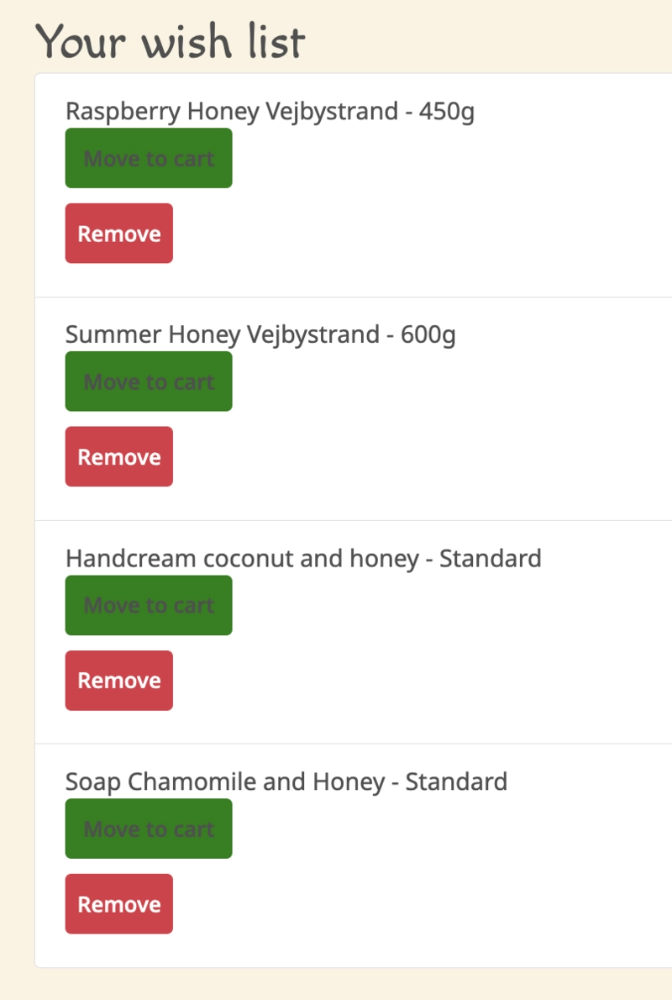

# PP5-Real_Honey - Buy Local, Authentic Honey - Online

   **Real Honey** is a user-friendly and scalable online marketplace that connects local beekeepers with customers, allowing them to purchase honey and honey products from the online store. 

**Table of Contents**

1. Project Overview

2. Business Model and Target Audience

3. User Experience (UX) Design Process

4. Features

5. Marketing

6. Validation, Testing & Bugs

7. Deployment

8. Technologies

9. Handling Product Images

10. Future Implementations

11. User Stories

12. Issues

13. Resources for Project Development

**1. Project Overview**

      * Key Goal
      To provide a seamless and enjoyable shopping experience while supporting local beekeepers.

      * Live Project:
      URL: https://pp5-real-honey-60f1f8b03b81.herokuapp.com/

      * Dummy Card for Testing: 
      - Card Number:  4242 4242 4242 4242
      - Expiry: 01/34
      - CVC: 123
      - ZIP: 12345

      * Test payments using Stripe test cards.
      - Card number 4242 4242 4242 4242 (successful)
      - Card number 4000 0000 0000 0002 (failed)
      - Card number 4000 0025 0000 3155 (3D Secure)

      Developer: 
      Andrea Nilsson

      Note: This project is for educational purposes only!

**2. Business Model and Target Audience**

   Business Model: 
      Real Honey is an e-commerce platform designed to connect local beekeepers with consumers who value natural, high-quality, and ethically sourced honey and bee products.

   This e-commerce website allows users to:
      - Browse, learn about and purchase a variety of honey-related products.
      - Support local businesses by offering a platform where small producers can showcase and sell their products directly to customers.
      - Complete secure purchases using Stripe as the integrated payment processor.

   Future business opportunities include:
      - Subscription model for recurring honey deliveries to loyal customers. 
      - Wholesale options enabling bulk purchases by retailers. 
      - Gift sets and seasonal promotions. 

   Target Audience:
      - Health-conscious individuals seeking organic and natural honey products.
      - Eco-friendly consumers supporting sustainable and local production.
      - Gift buyers looking for artisan products with traceable origins.
      - Beekeeping enthusiasts and supporters of biodiversity.
      - Online shoppers who value convenience, fast and reliable shipping.

**3. User Experience (UX) Design Process**

      3.1 The Idea:
         - Provide natural and ethically-sourced honey through a clean, easy-to-use platform.
         - Support local beekeepers and promote sustainable, small-scale production.
         - Allow customers to easily browse products, learn about them, and securely purchase them online.

      3.2 The Ideal User
         - Interested in natural and organic products.
         - Health- conscious individuals
         - Enthisiasts of unique honey flavours.
         - Supporters of sustainable and ethical sourcing.
         - Online shoppers looking for a convenient experience. 

      3.3 Site Goals
         - Allow easy browsing and product discovery through categories and filters.
         - Provide secure checkout and payment options.- Ensure site is accessible and SEO-friendly.- Promote products with strong visual appeal and clear information.

      3.4 User stories and Epics: 
         - All user stories were documented and managed via GitHub Issues and Project Board.

[View user stories on Github](https://github.com/users/Quetzaly88/projects/14)

      3.5 The Scope Plane*
         Implemented Features: 
         - Product Listings & Categorization
         - Sorting and Filtering of products
         - Cart and Checkout
         - User Authentication
         - SEO
         - Responsive Design

      3.6 The Structure Plan: 
         The website follows an organized structure. Each Django app manages its own URLs and templates, creating a modular and scalable project:

         - Products → List, Detail
         - Checkout → Cart, Payment, Confirmation
         - Shopping Cart → Wishlist, Saved items
         - Profiles → User account management, Order history
         - Newsletter signup and Social Media Mockups → Marketing and engagement
         - SEO → robots.txt and sitemap.xml
         - Static Pages → About, Contact
         - Error handling → Custom 404 page

         ## Sitemap
<!--  -->

  

         ----------

         ## Database schema

         ----------

      3.7 Wireframes: 
         Wireframes were created during the planning phase to ensure a user-centered design.
## Wireframes

      3.8 The Surface Plan
         Visual Elements: 
            Logo: Clean and minimalist logo designed to represent nature and honey.
<!--  -->

  

         3.8.1 Color Palette:
         ## Palette colors

         3.8.2 Typography: Simple, elegant, easy-to-read fonts, provided from Google Fonts. 
         
         - Macondo (Headings & Logo):
            Used to give the site a friendly, organic, and artisan feel, fitting the nature of honey and small business branding.

         - Noto Sans (Body text and UI):
            Used for general readability, user interface elements, product descriptions, and other body text. Ensures excellent legibility across devices.

         3.8.3 Icons: Font Awesome.

         3.8.4.Images: The project uses two different storage solutions to serve images, depending on their purpose.
         
         * Static Images (Logo, banners, 404, and default product images). Stored in /static/images directory. These images are part of the website design and layout and are necessary for:

         - Displaying the site logo in the header. 
         - Adding homepage slides/banners.
         - Showing a friendly image on the custom 404 error page.
         - Providing default product images if a product does not have one uploaded.

         These are collected and served through WhiteNoise and Heroku's static file system, ensuring they are always available to site visitors.

         * Dynamic Product Images (uploaded by admin). 
         
         - Stored on Cloudinary, an external cloud storage and CDN.
         - Uploaded through the Django admin or product forms.
         - Automatically optimized and resized for faster delivery and improved user experience.
         

**4. Features**

   *4.1 Core Features:*
         - Header and navigation: Consistent responsive navigation bar with logo, links to redirect the user to Home, Products and  Contact. The header has also the posibility to log-in/out the user, redirect to the shopping cart liked products. 

        
         - Footer: Includes contact info, adress and social media engagement. 

         - Wishlist management: Consistenly located in the navbar. The users are allowed to save the products for future reference. 
<!--  -->

  

         - Search functionality: Keyword search and filters help users find products easily. 

         - Notifications (on-screen and email): Provided for order confirmations and important events. 

   *4.2 Pages Overview:*

         - Landing page (Home): Highlights featured and best-selling products. 

         - Product list page: Displays avaiable products with filtering and sorting options. 

         - Product Detail page: Detailed view of product images, descriptions, avaiable sizes and prices. 

         - Shopping cart: Here the user can proceed to review or update the order. The user can proceed to chechout page. 

         - Checkout Page: Here can the user fill up their information and proceed to a Secure checkout process with Stripe payment integration. 

         - Order confirmation: The details of the order after the payment is successful.

         - Profile management page: Allows users to view and manage their account information, adresses and order history. 

   *4.3 Admin can edit, erase or add products in the live version, not just in admin.
      The CRUD functionality was adapted to be able to Create, Read, Update and Delete products through the live website, not only via Django admin panel. 

<!--  -->

  

      Features: 
         - Add Products: Admin users can access an "Add Products" link in the navigation bar when logged in, allowing them to create new products. The Admin can also add images from desktop. 

         - Edit Product: From each product’s detail page, admin users see an "Edit" button, enabling them to update product details (name, price, description, image, size, etc.).

         - Delete Product: Products can be safely deleted via a "Delete" button in product list and product detail, with confirmation prompts to prevent accidental removal.

<!--  -->

  

   *4.4 Future Implementations:*
      4.4.1 Bulk product import via CSV:
         This feature can be implemented in the future to allow administrators to upload product details through a CSV file, reducing the time and effort required for manual data entry. For this we will need to immport csv. This won't be done in this project now because this project is in a small scale, otherwise, it can be implemented in the future.
         https://docs.djangoproject.com/en/5.1/howto/outputting-csv/

      4.4.2 Future implementation product size:
         Currently, the product size options are defined as a set of predefined choices in the SIZE_CHOICES tuple. This approach ensures consistency and simplifies management for standard product sizes like 450g and 600g. However, it may require code updates every time a new size (e.g., 50g or 700g) needs to be added.

      4.4.3 Aditional Future Enhancements:
         - Product Inventory management
         - Improved search and filtering options
         - Wishlist functionality
         - Order tracking and status updates
         - Customer reward points and discounts
         - AI based product recomendations 

   *4.5 SEO and Error Handling*

      Custom 404 Error Page: A user-friendly 404 page is shown when non-existent pages are accessed.

      robots.txt: Added to guide search engines and allow them to crawl the website properly.
       https://pp5-real-honey-60f1f8b03b81.herokuapp.com/robots.txt

      sitemap.xml: Provides a sitemap for search engine bots to index all important pages.
      https://pp5-real-honey-60f1f8b03b81.herokuapp.com/sitemap.xml

      Meta Tags: Added meta description and keywords tags to improve SEO. Added this to base.html. 

      Broken Links Fixed: All previously broken links have been resolved, ensuring smooth navigation.

      Page titles: All pages use meaningful titles to reflect the page content and improve SEO.

**5. Marketing**
   This project incorporates several marketing techniques to increase brand visibility, reach the target audience and drive customer engagement across social media, SEO, and newsletter campaigns. The social media links are integrated into the website footer. These mockups were created instead of real social media businesses because of new security measures from Meta. 

   *5.1 Social Media Presence:*
      To simulate real-world social media marketing, mockups of social media pages were created and included in the project. For security, facebook doesn't alow fake businesses and accounts. The images were created using DALL-E 
      These mockups showcase how the product would be promoted across major platforms:

      *Facebook Page: Created to demonstrate page view and important information about the business. The "Shop now" call to action is included. 
      
## Facebook Page Mockups
<!--  -->

  

<!--  -->

  

      *Instagram Profile Mockup: Designed for mobile to showcase products, bio, and "Shop" functionality for easy product discovery.
## Instagram mockup
<!--  -->

  

      *YouTube Channel Mockup: Displays how video marketing and educational content about honey products could be used to promote the brand.

## Youtube chanel mockup
<!--  -->

  

   
   
   *5.2 Search Engine Optimization (SEO)*

      *SEO strategies have been implemented across the website to improve visibility in search engines and ensure proper indexing. 

      - SEO-friendly URLs and meta tags (title, description, keywords, and robots directives) included globally in the base.html template.

      - Product list page (product_list.html) has specific meta tags and canonical URL to prevent duplicate content across paginated views.

      - Product detail pages (product_detail.html) use dynamic meta tags that display product name, description, and images for each product individually. This improves indexing and sharing on search engines and social media.

      *Open Graph Tags:
      - Open Graph meta tags have been added to product list and product detail pages.
      
      - These allow the website’s content (including product images) to display properly when shared on social media platforms.

      *Canonical URLs
      - Canonical tags have been added to key pages such as product listings and product details to avoid duplicate content issues from pagination or sharing.

      *robots.txt and sitemap.xml:
      - robots.txt has been implemented to guide search engines on how to crawl the site.
      https://pp5-real-honey-60f1f8b03b81.herokuapp.com/robots.txt

      - sitemap.xml provides a sitemap for search engine bots to index all important pages.
      https://pp5-real-honey-60f1f8b03b81.herokuapp.com/sitemap.xml

      *Custom 404 page 
      - A user-friendly custom 404 page has been implemented for users visiting non-existent URLs, improving UX and avoiding SEO penalties. I tested using /none at the end of the live site URL.

      *Broken Links Fixed
      - All previously broken links were identified and corrected to ensure smooth navigation and avoid crawling errors.

      *Page Titles
      - All pages use clear and meaningful titles to improve indexing and help users understand the content.

      *Image Optimization
      - All product images are served through Cloudinary with automatic resizing and format optimization.
      - This improves page load speed and Largest Contentful Paint (LCP), which are important SEO ranking factors.
      - All images for README were resized and converted to Webp. 

   *5.3 Newsletter Signup
      - Users can sign up to receive updates and offers from the products. Emails are collected via a simple form and processed by the application. 
      - Simple signup form using Django forms
      - Users are shown a thank-you message upon submission
      - Demonstrates intent for marketing and customer re-engagement

      * Signup form avaiable here: https://pp5-real-honey-60f1f8b03b81.herokuapp.com/newsletter/

**6. Validation, Testing & Bugs**
   *6.1 Validation*
      6.1.1 HTML, CSS and JavaScript validation:
         - The code was validated using W3C validators to ensure clean, semantic markup and avoid errors or warnings. For HTML was used 'Source code'. This code comes clean from Python code to avoid confusion in the validator. 

         - JavaScript syntax warnings are not errors and are safe to ignore, as the project targets ES6+ and runs correctly in all modern browsers. Linter configuration was adjusted using /* jshint esversion: 11 */.

      6.1.2 SEO validation
         - Google Lighthouse was used to validate that meta tags, robots.txt, sitemap.xml, and alt attributes were implemented properly.
         - The site was tested using Lighthouse to ensure compliance with accessibility standards.
<!--  -->

  

   *6.2 Testing*
      6.2.1 Manual and automated testing
         - Manual testing was performed regularly during development, including navigation, forms, and checkout process.
         - print() and console.log() were used during development to debug and trace issues.

      6.2.2 User experience Testing
         - Tested across different devices and browsers to ensure responsiveness and a consistent user experience. 
         - Use of dev tools for responsiveness and cloudinary automatic sizing for images. 

      6.2.3 Payment Gateway Testing
         - Stripe integration was tested using provided dummy credit card details to confirm payment flow and order creation.

   *6.3 Bugs and fixes*
      - Issues with Stripe due to missing postload.js in base.html. 
      - Several changes on models for better performance. 
      - Fixed checkout and Stripe integration: Ensured that cart items persisted untill payment confirmation.
      - Add default favicon to avoid 404 error. 
      - Fixed error in Order and OrderLineItem models to prevent AttributeError.
      - Resolved pagination issue and wishlist items to transfer correctly to cart. 
      - Resolved issue of best sellers and featured products not seen in home page. 
      - Reinstallation of Django that was causing problems for lack of compatibility....

   *6.4 Python Code Validation*
      **[Flake8](https://flake8.pycqa.org/)** 
         - Was used to identify issues such as unused imports, indentation problems, trailing spaces, etc.
            Bash: 
               pip install flake8
               flake8 .
               
            Configuration (.flake8 file):
               [flake8]
               ignore = E501
               exclude =
                  venv,
                  migrations,
                  __pycache__,
                  static,
                  manage.py,
                  .vscode,
                  settings.py
               max-complexity = 10

         - ignore = E501 ignores "line too long" warnings.
         - exclude irrelevant files and its warnings. 

      **[Autopep8](https://pypi.org/project/autopep8)** 
         - Used to automatically format code according to PEP8 standards. 
            Bash: 
               pip install autopep8
               autopep8 . --in-place --recursive
               flake8 .

   *6.5 Static Files and Deployment Validation*
      Static files (CSS, JavaScript, images): Static files were configured work in both development and production using WhiteNoise and Django's static settings:

         Bash:
            STATIC_URL = '/static/'
            STATICFILES_DIRS = [BASE_DIR / 'static']
            STATIC_ROOT = BASE_DIR / 'staticfiles'

         - Collect static command: % python manage.py collectstatic 

         - DISABLE_COLLECTSTATIC = 1 is removed from config vars in Heroku. This variable skips static file collection, which breaks CSS, images and JavaScript in production.

      Middleware configuration:
               MIDDLEWARE = [
         'django.middleware.security.SecurityMiddleware',
         'whitenoise.middleware.WhiteNoiseMiddleware',
         ...]

      Deployment command for Heroku: % heroku run --app pp5-real-honey "python manage.py collectstatic --noinput"

            - This process ensures static files are properly served and visible on the deployed application.

**7. Deployment**
   *7.1 Deployment Overview*
      The project was developed locally using VS Code and Git for version control. Once development was complete, the code was pushed to GitHub and then deployed to Heroku.
         - Code pushed regularly from VS Code to GitHub.
         - Deployed from GitHub to Heroku using Heroku CLI and Git integration.

      *7.2 Heroku Deployment*
         7.2.1 Prepare the Project for deployment 
            - Install heroku: 
            Bash:
               brew tap heroku/brew && brew install heroku
               heroku --version

            - Install required Dependencies:

            * psycopg2-binary: Required for PostgreSQL database connection.
            * dj-database-url: Allows easy database configuration using a DATABASE_URL environment variable.
            * gunicorn: A production-ready web server for running Django applications on Heroku.

               After installation the 'pip freeze > requirements.txt' file was updated to include dependencies. 

            - Configure Environment Variables:
               DO NOT commit .env.py to Github

                  import os
                  os.environ.setdefault('SECRET_KEY', 'your-secret-key-here')

                  In settings.py, we updated the SECRET_KEY to use the environment variable instead of hardcoding it:

                  import os
                  SECRET_KEY = os.environ.get('SECRET_KEY')

         7.2.2 Configure PostgreSQL Database
            Since SQLite is not suitable for production, we migrated to PostgreSQL, a cloud-based relational database provided by Heroku.
            * Created a PostgreSQL database using Code Institute's PostgreSQL instance. 
            * Updated settings.py to support PostgreSQL:

                  import dj_database_url
                  if 'DATABASE_URL' in os.environ:
                     DATABASES = {
                        'default': dj_database_url.parse(os.environ.get('DATABASE_URL'))
                     }
                  else: 
                     DATABASES = {
                        'default': {
                              'ENGINE': 'django.db.backends.sqlite3',
                              'NAME': BASE_DIR / 'db.sqlite3',
                        }
                     }
         * The DATABASE_URL was retrieved from Heroku Config Vars.

            Find 'import env' in settings and replace with: 
               if os.path.isfile("env.py"):
               import env
               from pathlib import Path

         7.3.3 Setting up Heroku:
            * Log in to heroku and create the app
               heroku login
               heroku create pp5-real-honey

            * Set conf vars in Heroku: 

               - DISABLE_COLLECTSTATIC:  1
               - SECRET_KEY: Random secret key from  https://randomkeygen.com/
               - DATABASE_URL	PostgreSQL URL generated by Heroku
               - CLOUDINARY_URL	Cloudinary config URL
               - STRIPE KEYS

            * Create Procfile in root directory with this information: 
               - web: gunicorn real_honey.wsgi:application

            * Create runtime.txt with this info:
               - Python 3.12

            * In settings.py, add the URL for your app to the ALLOWED_HOSTS. Remove https:// from the start of the URL, and the trailing slash from the end of the URL:
               - 'pp5-real-honey-60f1f8b03b81.herokuapp.com'

            * In .env Debug Mode (True for development, False for production)
            DEBUG=False. Before Deployment. 

         7.3.4 Final Deployment
            - Pushed all code to GitHub.        
            - Connected GitHub repository to Heroku app.
            - Enabled automatic deployment or manually deployed latest commit.
            - The app was successfully deployed and can be accessed via the Heroku live link.

**8. Technologies & Credits**
   8.1 Technologies:
         - Django: Backend framework used for building the web application.

         - Django Allauth: Used to set up the complete authentication and user account system.

         - Python: Core programming language for backend logic and integrations.

         - HTML, CSS, JavaScript: Frontend technologies used to build the user interface.

         - Bootstrap: UI framework for responsive design and layout.

         - PostgreSQL: Relational database used in production.

         - Flake8: Python linting tool to maintain code quality and PEP8 compliance.

   8.2 Python-Decouple
         Used to securely manage secret keys and sensitive environment variables.
               - Keeps secret keys secure by storing them in .env (added to .gitignore)
               - Improves maintainability by separating configuration from the codebase.
               - Prevents security risks by avoiding storing secrets in vesion control. 
                  
         Instalation: pip install python-decouple

         Usage: Create a .env file in the project root to store sensitive variables like:

               SECRET_KEY='your-django-secret-key'
               STRIPE_PUBLIC_KEY='your-public-key-here'
               STRIPE_SECRET_KEY='your-secret-key-here'
               STRIPE_WEBHOOK_SECRET='your-webhook-secret-here' # if needed
               DEBUG=True  # Change to False in production

         Load the secrets in settings.py:

               from decouple import config
               python-decouple

               SECRET_KEY = config("SECRET_KEY")  # Securely fetch secret key
               STRIPE_PUBLIC_KEY = config("STRIPE_PUBLIC_KEY")
               STRIPE_SECRET_KEY = config("STRIPE_SECRET_KEY")
               STRIPE_WEBHOOK_SECRET = config("STRIPE_WEBHOOK_SECRET") # if needed
               DEBUG = config("DEBUG", default=False, cast=bool)
            
      [Stripe Payment Integration:]
         Overview:
            * Stripe payment processing in the project. Stripe is used to securely handle online payments for customer orders. 
                  1. Pip Install Stripe
                  2. Open an account in Stripe to obtain API Keys. This keys are added in the main settings.py.
                  3. Modify checkout/views.py
                     - Creating a Stripe PaymentIntent
                     - Passing the client secret to the frontend
                     - Handling order creation after successful payment. 
                  4. Modify checkout.html
                        - Ensure that checkout.html passes the client_secret to Javascript
                  5. Create stripe.js for Payment Processing.
                     - Path: checkout/static/js/stripe.js
         Conclusion: 
               This integration allows secure payment processing using Stripe Elements. It ensures that: 
                  - No sensitive card details are stored on the server.
                   - Secure and efficient transactions.
                   - Real-time validation and error handling. 

   8.3 Stripe Integration and Webhooks
      Stripe webhooks were integrated into the project to handle payment confirmations after checkout.
         * Installing Stripe CLI: 
            1. In Mac terminal install Homebrew (If Not Already Installed)
            Homebrew is a package manager for macOS that simplifies software installations.
               Verify Homebrew Installation:
               bash: brew --version
            2. Install Stripe CLI
            bash: brew install stripe/stripe-cli/stripe
                  stripe version
            3. Stripe CLI was authenticated with:
            bash: stripe login

         * Local Webhook Testing
            - checkout/webhooks.py was modified to print and return a success response to confirm webhook reception:
               print('Success!')
               return HttpResponse(status=200)
            - settings.py was updated to include localhost in ALLOWED_HOSTS.

            - Stripe CLI was used to forward webhook events to the local server:
               stripe listen --forward-to localhost:8000/webhook/

            - Test events were triggered using:
               stripe trigger payment_intent.succeeded

            - The Django terminal confirmed webhook receipt:
               Webhook received: payment_intent.succeeded
               Success!

            - Webhook Signing Secret
               Stripe webhook secret was stored securely in .env and loaded into settings.py using python-decouple.

            - Verification
               Stripe Dashboard → Developers → Events were used to verify that webhook events returned a 200 OK response.

               Webhook events successfully updated orders after payment confirmation.

         *Notes
            Webhook keys expire every 90 days and must be renewed using stripe login.

            Stripe webhook integration is complete and working in production to handle post-payment actions.

**9. Handling product images and Product information**
   To ensure product data and images persists across deployments a combination of fixtures and Cloudinary storage was used. 
   This approach ensures consistency, avoids missing product information, and optimizes media delivery for fast page load times.

   9.1 Product Fixtures (Backup and loading Process)
      1. Create a fixture file (Backup of all product data)
         - products/fixtures/ all_products_backup.json
      2. Load fixtures into the Database
         - python manage.py loaddata fixtures/products.json
      3. Dump Existing Data into a Fixture to export current data as a fixture
         - python manage.py dumpdata app_name.ModelName --indent 2 > fixtures/products.json

   9.2 Fixing Missing Product Information
      To ensure all products have a short description, an automation script was created:

      1. Create and store the script
         - Create a new Python script named update_fixtures.py in the root directory of the project (same level as manage.py).
         - The script reads products/fixtures/all_products_backup.json, updates missing descriptions, and saves a new fixture file. (code copied from chat.gpt)
      2. Run the Script to Update Missing Descriptions
         - python update_fixtures.py
         This generated an updated fixture file:
            - all_products_backup_updated.json
      3. Load the Updated Fixture into the Database
         - python manage.py loaddata products/fixtures/all_products_backup_updated.json
      4. Verify Data in Django Admin and Product Listings
         - Check if descriptions are correct and ensure proper display
      5. Replace the old Fixture with hte updated one
         - mv products/fixtures/all_products_backup_updated.json products/fixtures/all_products_backup.json

   9.3 Product Images Handling via Cloudinary
      **AWS S3 was originally planned but replaced with Cloudinary because of ease of integration and deployment speed. Cloudinary now handles all product media files.**

      Product images are now automatically uploaded and managed through Cloudinary, which provides:
         - Optimized delivery via CDN (Content Delivery Network)
         - Automated resizing and compression for better performance
         - No need to manage media files directly in Heroku. 

      Reason for using Cloudinary:
         - AWS S3 setup did not work as expected
         - Cloudinary was faster to configure and offers good performance
            Process: 
               1. Install Cloudinary and add it to requirements.txt.
                  - pip install cloudinary django-cloudinary-storage
                  - pip freeze > requirements.txt
               2. Upload images from desktop to Cloudinary.
               3. CloudinaryField used in Product/models for automatic handling.
               4. Update settings.py an add secret keys in Heroku. 

            Testing:
               - Added product images via Add Product page and Django Admin. 
               - Verified images uploaded to Cloudinary Media Library
               - Confirmed images display properly on product pages
                  Images now display across the site, fixing all broken image issues from initial deployment.

      Template image Fixes:
         In Product List and Product Detail issues arised during testing. The product pages would crash and show a TemplateSyntaxError related to the replace filter. Django templates do not support the replace filter by default, which caused a 500 server error. 
         
            - The issue was fixed by removing all 'replace' filters from the templates. 
            - Added lazy loading and a default fallback image (default.jpg) for improved user experience and performance.

**10. Future Implementations**
   While this project successfully implements key e-commerce functionalities (product browsing, user authentication, shopping cart, wishlist, checkout, and Stripe payments), there are still additional features that could be added in the future:

      - Product reviews and ratings 
      - User profile with order history
      - Newsletter email automation 
      - Discount codes and promotional offers
      - Admin dashboard for better product and order management
      - Multi-language support for internationalization

   These features could further enhance user experience and business capabilities.

**11. User Stories:**
   User stories were created and managed using GitHub Projects to guide the development process and ensure that all the steps are created in order. 
      The user stories cover:
         - Product browsing and searching
         - Wishlist functionality
         - User registration and authentication
         - Shopping cart and checkout process
         - Order confirmation and payment integration
         - Admin and product management tasks
         
   The user stories were created with the intention to help the development process, trying to be very clear in every step. 

   View the user stories here: [View User Stories (GitHub Project Board)](https://github.com/users/Quetzaly88/projects/14)

**12. Issues**

   12.1 Stripe Integration Fixes-Summary:
      Implemented critical fixes to "Stripe integration" to ensure smooth payment processing and reliable webhook handling.  

      *Client Secret & Public Key Handling
      - Used `json_script` to safely pass `client_secret` and `stripe_public_key` to JavaScript, preventing encoding issues.  

      *Checkout Data Caching   
      - Implemented an AJAX request to **cache checkout data** before confirming payment, ensuring order details are available for Stripe webhooks.  
   
      *Improved Payment Submission Flow
      - Disabled the submit button while processing payments to **prevent duplicate submissions**.  
      - Restored the button if errors occurred to allow users to retry.  

      *Conditional Stripe Script Loading
      - Ensured Stripe JS only loads on the checkout page, preventing `clientSecret` and `stripePublicKey` errors elsewhere.  

      *Webhook Testing & Validation
      - Used **Stripe CLI** (`stripe listen --forward-to localhost:8000/checkout/webhook/`) to validate webhook events.  
      - Successfully triggered `payment_intent.succeeded` to verify order processing.  

      I resolved a critical Stripe card element mounting issue that prevented payments from processing. Additional checks ensure the card element remains in the DOM before confirming payments. We also fixed a KeyError: 'county', ensuring all order fields are handled properly

      *Final Outcome:
      - Orders are **properly linked** to checkout data and webhook responses.  
      - Payments are **validated & confirmed** before redirecting users.  
      - Stripe webhooks **reliably process** order completions.  

      *Stripe payments are now fully functional. Because of my deadline I used AI to help me out fixing this issue. Javascript code was pasted to avoid more critical issues. 

   12.2 CLOUDINARY SETUP
      * Create a claudinary account and set up a confirmation code to be able to see the api secret key.
      * CLOUDINARY_URL=cloudinary://<your_api_key>:<your_api_secret>@dapm2mnex

      Media Files Storage – Cloudinary
      Originally, the project was planned to use AWS S3 for media storage.
      However, after reviewing the project requirements and the importance of rapid deployment, Cloudinary was chosen for the following reasons:

      * Simpler and Faster Setup: Cloudinary integrates easily with Django using the django-cloudinary-storage package, requiring fewer configuration steps compared to AWS S3 (which needs IAM users, CORS setup, storage classes, etc.).

      * Ideal for Portfolio Projects: Cloudinary offers a free plan that fits the needs of this e-commerce application without extra configuration for custom domains or regional buckets.

      * Quick Deployment: Cloudinary allows rapid deployment of media files in production environments like Heroku, where file systems are ephemeral (i.e., lost after dyno restarts).

      * Built-in Image Optimization: Cloudinary automatically optimizes images for faster loading times, improving UX and SEO without additional settings.

         How It Was Implemented:
         1. Installed the required packages:

            pip install django-cloudinary-storage cloudinary

         2. Media File Storage - Local Development vs. Cloudinary Production. 
            In order to handle media files correctly during development and production, the following smart configuration was implemented in settings.py:

            if 'DEVELOPMENT' in os.environ:
               DEFAULT_FILE_STORAGE = 'django.core.files.storage.FileSystemStorage'
            else:
               CLOUDINARY_STORAGE = {
                  'CLOUD_NAME': os.environ.get('CLOUDINARY_CLOUD_NAME'),
                  'API_KEY': os.environ.get('CLOUDINARY_API_KEY'),
                  'API_SECRET': os.environ.get('CLOUDINARY_API_SECRET'),
               }
               DEFAULT_FILE_STORAGE = 'cloudinary_storage.storage.MediaCloudinaryStorage'

            * ADD DEVELOPMENT=1 in the .env file TO BE ABLE TO SAVE UPLOADED IMAGES INTO THE LOCAL /MEDIA/ DIRECTORY. 

         3. Configured environment variables securely in Heroku Config Vars.

         4. Updated requirements.txt and deployed to Heroku.

      All product images and user-uploaded files are now safely stored and served via Cloudinary.
      This choice ensured a faster, simpler, and more reliable deployment for the project's timeline and technical requirements.

   12.3 LIGHTHOUSE WARNINGS
      As the project is almost in the last stage, the lighthouse was performed. 
      There were issues like "The page was loaded over HTTPS, but requested an insecure element..."
         - SECURE=True in CLOUDINARY_STORAGE settings was written. 
         - command grep -r "http://" showed all the http:// still left in the project. 
            Most of the http:// were located in .venv so I just ignore those. 

   12.4 COUPON FEATURE FIX AFTER PROJECT FEEDBACK: 

      After receiving project feedback regarding a server error during coupon validation, the coupon system was refactored to ensure reliability, accuracy, and user clarity. The improvements included correcting logic errors, securing dynamic calculations, and enhancing user feedback.

       - Invalid Field Access:
         The original logic referenced a non-existent field coupon.expiry_date, causing a 500 Internal Server Error. This was corrected to use the correct model field coupon.expires_at.
            
      - Unsafe Total Calculation:
         The cart total was previously fetched from the session via request.session.get('cart_total'), which could be missing or outdated. The logic now recalculates the total dynamically from the current cart items for both authenticated and guest users. This ensures accuracy and stability.

      - Long Decimal Discount Display:
         Discount amounts appeared with excessive decimal places (e.g., 0.9000000000000001). This was resolved by formatting the discount with Django's template filter:
            {{ coupon_discount|floatformat:2 }}
            Resulting in a user-friendly display like 0.90.

      - Coupon Persistence Issue:
         Users could change cart items after applying a coupon, causing inconsistencies. A centralized function invalidate_coupon() now resets the coupon if the cart is updated (add, remove, or quantity change), and users are notified to reapply their code.

      The coupon system is now more robust, accurate, and user-friendly — with clear messages, valid discount calculations, and improved frontend display.
         

**13. Resources for Project Development**
      This project used a variety of resources, including official documentation, Code Institute material, ChatGpt for troubleshooting and Stripe/AWS/Cloudinary setup guidance. There are some comunity tutorials and information from chat groups. 

   - navbar: https://getbootstrap.com/docs/4.0/components/navbar/

   - Bootstrap 4 Card container: https://bbbootstrap.com/snippets/card-container-48980697

   - bootstrap pagination: https://getbootstrap.com/docs/4.0/components/pagination/

   - color palette generator http://colormind.io/image/

   - footer bootstrap snippet https://mdbootstrap.com/snippets/standard/mdbootstrap/2885115

   * Helpful siates for image handling
   - cloudinary https://cloudinary.com/
   - Sqoosh resize images https://squoosh.app/
   - DALL-E open AI's image creator https://chatgpt.com/g/g-2fkFE8rbu-dall-e

   * Images
   - https://www.iloveimg.com/
   - https://squoosh.app/
   - Resize in Github/README https://gist.github.com/uupaa/f77d2bcf4dc7a294d109

   * Python/Django:
   - https://www.codecademy.com/
   - https://www.techwithtim.net/
   - https://django-extensions.readthedocs.io/en/latest/

   * Documentation for settings: 
   - https://docs.djangoproject.com/en/5.1/topics/settings/
   - https://docs.djangoproject.com/en/5.1/topics/http/sessions/#settings
   - https://docs.djangoproject.com/en/5.1/ref/settings/#std:setting-MESSAGE_TAGS
   - https://docs.djangoproject.com/en/5.1/ref/settings/

   * Documentation for Stripe and Decouple: 
   - https://docs.stripe.com/js/payment_intents/confirm_konbini_payment
   - https://dashboard.stripe.com/test/dashboard
   - https://pypi.org/project/python-decouple/
         https://simpleisbetterthancomplex.com/2015/11/26/package-of-the-week-python-decouple.html
   - https://simpleisbetterthancomplex.com/2015/11/26/package-of-the-week-python-decouple.html

   * Documentatiou used for README:
   -https://lucid.app/ Lucidchart for sitemaps, database and wireframes.
   - Database Schema https://dbdiagram.io/d

   - META Tags https://www.semrush.com/blog/
               https://ahrefs.com/blog/open-graph-meta-tags/#what-are-open-graph-tags

   * Documentation for resolve issues found in LIGHTHOUSE:
      - https://developer.chrome.com/docs/lighthouse/performance/lighthouse-largest-contentful-paint/?utm_source=lighthouse&utm_medium=devtools
      - https://community.cloudinary.com/discussion/639/persistent-poor-lcp-largest-contentful-paint-score-in-lighthouse

   * Deployment: https://dashboard.heroku.com/

